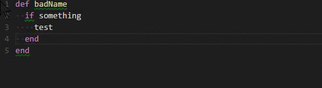

# README

This is extension for Visual Studio Code.

Visual Studio Code 上で rubocop を実行します。

execute rubocop
- by execute command "Ruby: execute rubocop" (press F1)
- on Saving .rb file



# Configuration

Speciry to config ruby.rubocop.executePath

```
{
	"ruby.rubocop.executePath": "D:/bin/Ruby22-x64/bin/",
	"ruby.rubocop.onSave": true // default true
}
```

# todo

- more configurable command line option (like -R)
- integration with rbenv